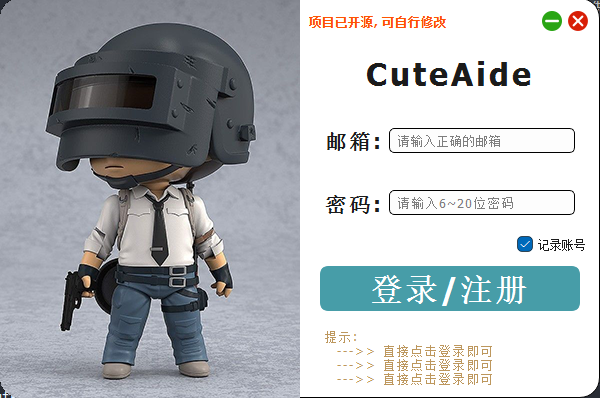
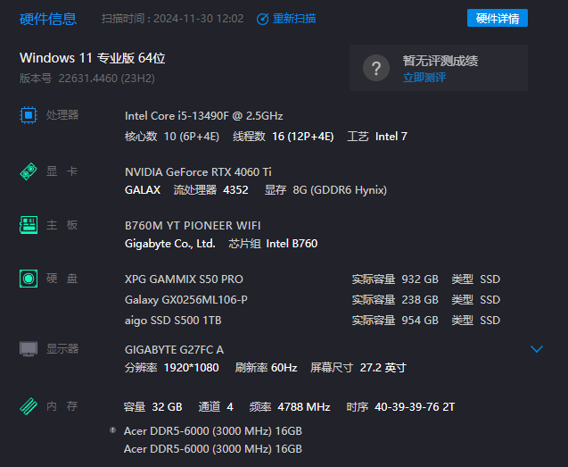
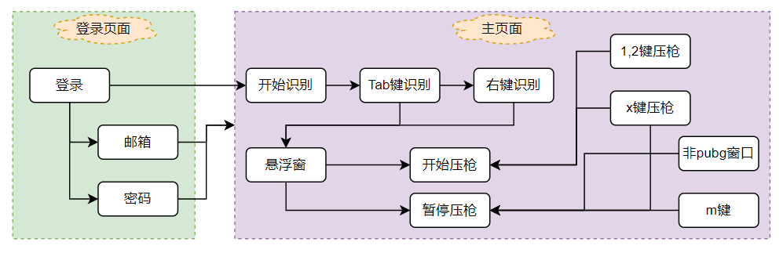
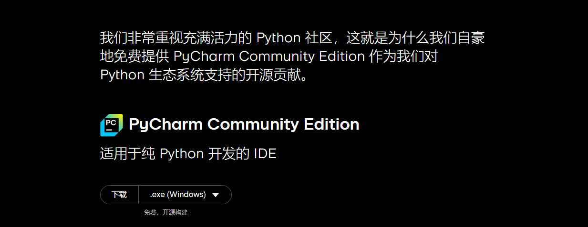
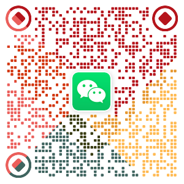

<h1 align="center">CuteAide</h1>

一个能够自动识别 PUBG 装备、自动压枪的软件, 帮助你更轻松的游戏🎮.

本人由于工作原因, 已无力适配所有设备, 特此将项目开源, 后续仅对自己设备及使用习惯进行优化维护(和我一样的设备可以继续使用), 需要的朋友可以自行下载源码进行二次开发.

QQ 交流群：[679556431](https://qm.qq.com/cgi-bin/qm/qr?k=C_li-vF5tFboRacsQm7II86lwsY1P4gg&jump_from=webapi&authKey=IN7xudayhxrku/cQCHZkluKEZxuPQo2dX3UYei3E/vfGz932L96LV76u17VB4D8f)

> 特别说明:
> 1. 本软件仅供娱乐、学习交流, 请勿用于商业用途;
> 2. 本软件仅供 PUBG 游戏内使用, 请勿用于其他游戏;
> 3. 使用本软件造成的一切后果由使用者自行承担, 与作者无关.

## 效果展示

<div style="display: flex;">
    
    
</div>
<br/>


## 本人设备



## 项目结构

``` python
│
├── basic    # 基础源图
│
├── libs     # 逻辑源码
│    ├── home
│    │    ├── home_win.py       # 主界面
│    │    └── state_win.py      # 状态界面
│    ├── login
│    │    └── login_win.py      # 登录界面
│    ├── cache.py               # 缓存
│    ├── global_veriable.py     # 全局变量
│    ├── gun_info.py            # 获取枪械信息
│    ├── handle_image.py        # 图像处理
│    ├── keylisten.py           # 键盘监听
│    ├── monitor.py             # 显示器获取
│    ├── mouselisten.py         # 鼠标监听
│    ├── pressure.py            # 数据整理及输出
│    └── screenshot.py          # 截图及图像判断
│
├── resource                    # 资源图
│
├── tools
│    ├── active_window.py       # 获取当前活动窗口
│    ├── files.py               # 文件处理
│    ├── log.py                 # 日志相关
│    ├── paths.py               # 文件路径
│    └── screenshots.py         # 截图工具
│
├── views                       # UI 视图
│
├── common.py                   # 公共信息
├── CuteAide.spec               # 打包相关信息
├── gun_data.json               # 枪械数据
├── main.py                     # 主程序
├── README.md                   # 说明文档
├── requirements.txt            # 依赖包
└── script.lua                  # 罗技压枪脚本
```

## 大概流程图



## 项目下载使用

### 0. 环境准备

- [Python 3.11](https://www.python.org/downloads/release/python-3119/) (3.11以下的版本不保证运行不会报错)
- [Pycharm](https://www.jetbrains.com/zh-cn/pycharm/download/?section=windows) (有能力可以下载专业版, 囊肿羞涩可以下载`社区版`, 社区版在官网最下方) 
<div style="display: flex;">
    
</div>

### 1. 下载项目

``` bash
git clone https://github.com/Pupper0601/CuteAide.git
```

### 2. 安装依赖

``` bash
pip install -r requirements.txt
```

### 3. 运行程序

``` bash
python main.py
```

### 4. 打包程序

``` bash
pyinstaller CuteAide.spec
```

## 软件使用说明

[CuteAide 使用图文教程.pdf](CuteAide%20%E4%BD%BF%E7%94%A8%E5%9B%BE%E6%96%87%E6%95%99%E7%A8%8B.pdf)

## 如果对你有帮助, 请给个 Star ⭐️, 请作者喝杯咖啡 ☕️, 谢谢!

<div style="display: flex;">
    
    
</div>


